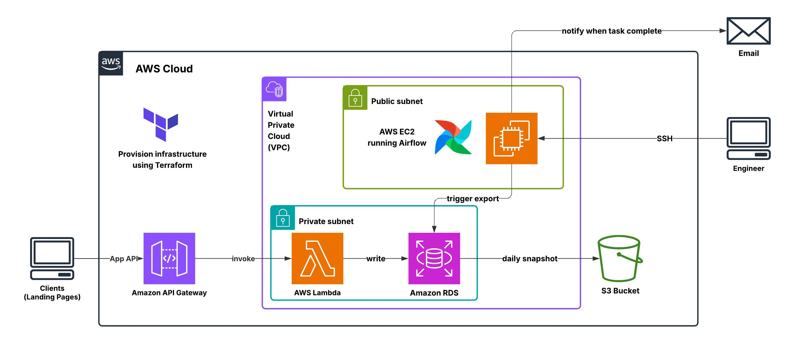
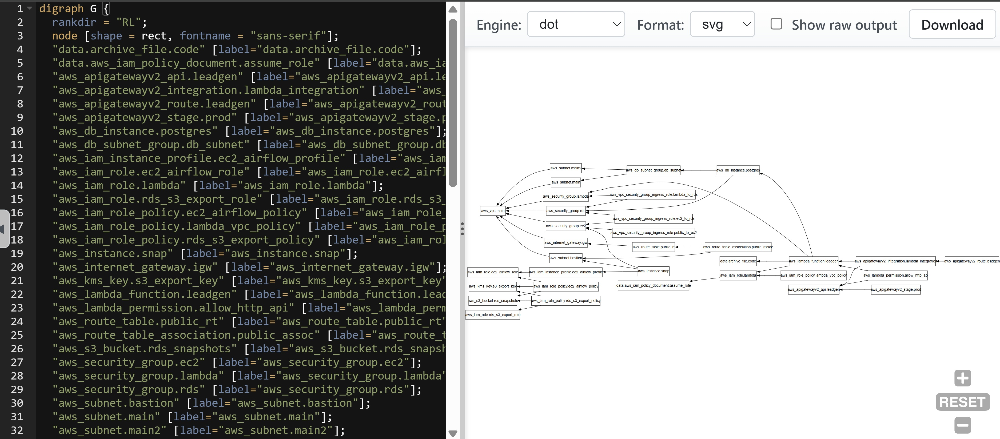
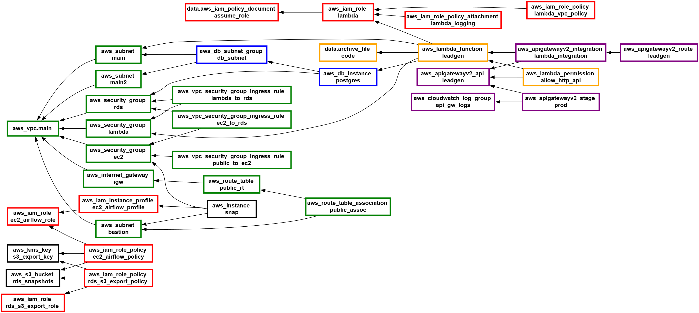
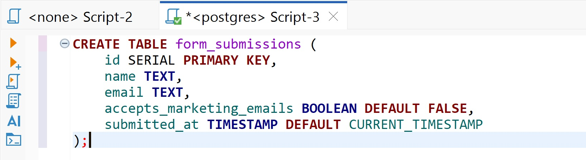
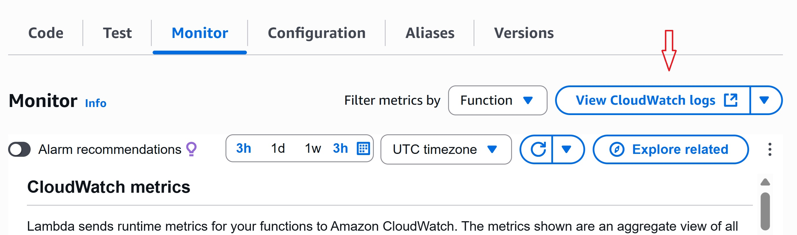
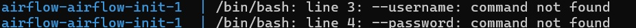

# Data pipeline for lead generation

In this project, I build a data pipeline that hook leads info from landing pages form fill and write it on a database inside AWS. I also schedule to daily took a database snapshot and store in S3 data lake for further analytics use.

## Architecture

Below is the diagram I draw using lucid.app 

## Project building process

### Step 1 : Make a rough idea

I want to create a data flow for lead generation through form to writing them into database.  

I design as if the database is connected to an application running on AWS, such as a CRM. Typically, the data side starts with daily batch processing, such as taking database snapshots and storing them in a data lake.

First I want the landing page be create by any service outside AWS.  
So this project will be very flexible to apply to any kind of landing pages.  
But we need one prerequisite:  
It must be able to send HTTP request whenever lead submit the form.

The typical solution will be the webhook model.  
So, most popular combo API gateway + Lambda.

For database, the lead info field are not complicate (like Name, email, etc.).  
So I pick relational database, PostgreSQL on Amazon RDS.

Now I need an orchestration tool for database daily snapshots.  
A popular open-source option, Airflow, which runs natively on Linux.  
I host it on an EC2 instance. This instance will be use to access to RDS too.

On top of the project, I use Terraform for provisioning AWS resources.

### Step 2 : Writing a terraform file

Terraform resources we have to create are not just service units like an EC2 instance or an S3 bucket. Services of compute types are deployed inside a VPC (Virtual Private Cloud). Interaction between services require certain group of rules to make it happen.

I split resources into 4 categories.

1. Networking resources
    - VPC
    - Subnets
    - Security groups
    - Internet Gateway + route table (For making a subnet public)
2. Services Units
    - API gateway
    - Lambda
    - RDS
    - EC2
    - S3
3. IAM roles
    - Lambda's role (run in VPC + interaction with RDS)
    - EC2's role (perform orchestration between RDS and S3)
    - RDS's rile (export snapshots)
4. etc.

#### Tracking dapendency

While drafting, it is difficult to see the overall picture of resources we have written on our Terraform code by just look at it. `terraform graph` returns a dependency graph in DOT format (from Graphviz).

I use online tool https://dreampuf.github.io/GraphvizOnline/ to draw the graph.
It's easy too drag and zoom in/out.

**caution:** sometimes `terraform graph` is not 100% correct.
I have to recheck from the code to be sure. 
  
After some customization the diagram will become easier to read.

### Step 3 : Writing a Lambda function code 

First, my lambda function has to handle body of HTTP requests that store lead data.  
I use `json` to extract information.

Next we want to connecting to our RDS database which running PostgreSQL.  
I use `os` to import environment variables and `psycopg2` for the connection.  

You can look at the file `lambda/main.py`

### Step 4 : Writing a DAG file and Docker Compose for Airflow

I use Docker Compose to simplify installation.

In LocalExecutor setup, the main Airflow components needed are:
1. Database for metedata
2. Webserver
3. Scheduler
4. Initialization (airflow-init), only run once to initialize. 

Source for minimal Airflow setup: https://airflow.apache.org/docs/apache-airflow/stable/core-concepts/overview.html#required-components 

For snapshots creation and exporting, we use the Python package `boto3` which allow us to interact with resources in AWS. 

Unlike other client tools like psycpg2, when we use boto3, we don't import any credential variables into the code. It will automatically search in various places.  
See: https://boto3.amazonaws.com/v1/documentation/api/latest/guide/credentials.html

Since I run Airflow in an EC2 instance with a proper IAM role, I don’t need to manually store AWS access keys on the instance.

You can look at the directory `airflow`

### Step 5 : Test the result

**5.0. Create resources**

In Terraform directory, runs `terraform init` for plugins initialization.  
Then runs `terraform plan` to review plan and possibly errors.  
Then runs `terraform apply`.

**5.1. Connecting to RDS** 

Using SSH local port forwarding to map RDS port 5432 to my local machine through a bastion EC2.

`ssh -i <path to key> -L <local_port>:<rds_endpoint>:<rds_port> ec2-user@<ec2_public_ip> -N`

**5.2 Prepare database** 

Use DBeaver to connect to the database (which now host=localhost).
Create a table to prepare for writing.

**5.3 Test Lambda function** 

Write a simple script to send a simple POST request to the API gateway endpoint.

Since I already add a permission for lambda to write to CloudWatch, I can look at the CloudWatch log.

**5.4 Upload necessarily files to EC2 and run Airflow**

I run Secure Copy Protocol by 
 `scp -i <Path to SSH key> -r <Airflow folder path> ec2-user@<EC2IP>:/home/ec2-user/` to send the folder `airflow/`

After that SSH into the instance, then run  
`sudo dnf update -y`  
`sudo dnf install -y docker`  
(`dnf` is a Package management tool for Amazon Linux 2023).

Then start docker service:  
`sudo systemctl start docker`  
`sudo systemctl enable docker`

Give ec2-user permission to run without `sudo`:  
`sudo usermod -aG docker ec2-user`

Install Docker compose:  
`sudo curl -L "https://github.com/docker/compose/releases/download/v2.20.2/docker-compose-$(uname -s)-$(uname -m)" -o /usr/local/bin/docker-compose`  
`sudo chmod +x /usr/local/bin/docker-compose`  

Install Python3 + pip:  
`sudo dnf install -y python3 python3-pip`  

Now we can start Airflow:  
`docker-compose up airflow-init`

**5.5 Check the snapshot in S3**

### Step 6 : Finalize the project

I will not forget to delete all resources created in this project via `terrform destroy` to avoid AWS bill.  
Keep tracking the service AWS Billing and Cost Management for a while.

Below I documented some of interesting mistake during the process.

#### 6.1. Default outbound rule in security group

When we create a new security group manually in the AWS console, AWS automatically adds a default outbound rule that allows all outbound traffic (`0.0.0.0/0` on all ports/protocols).

Creating a security group via Terraform does not apply that. We have to define egress rule block.  

#### 6.2. File for lambda layers

The file inside the zip has to have python as the root directory.  
source: https://docs.aws.amazon.com/lambda/latest/dg/python-layers.html

#### 6.3. Errors while try to run Airflow

When I run `docker-compose.yaml up airflow-init` I encounter a lot of errors.

  - 

    It try to execute flags as separate command. So a quick fix is not to use new line `\` and write the command in a single line in compose file, since indentation is sensitive in yaml. 

  - <pre>PermissionError: [Errno 13] Permission denied: '/opt/airflow/logs/scheduler/2025-09-06'

    ...
    ValueError: Unable to configure handler 'processor'</pre>

    This happened because I mount volume to `./opt/airflow/logs/` in compose. Note that Airflow official image create and use a user of UID 50000. So I just need to create directories and change their permission so the container’s airflow user can read/write.

    `mkdir -p logs dags plugins`  
    `sudo chown -R 50000:50000 logs dags plugins`

  - SSH becomes slow to establish connection. This could because we open many ssh session without closing it properly.

    In EC2, just run `ps aux | grep ssh` to see all active ssh process and force kill using `kill -9 <PID1> <PID2> <PID3> ...`

    Note on flags: 
    - a – Show processes for all users, not just the current user.

    - u – Display the user/owner of the process + additional info.

    - x – Include processes not attached to a terminal (background or daemon).  

    - 9 = force kill