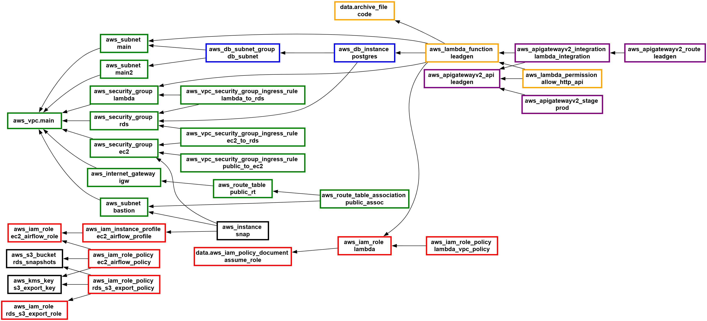

## Data pipeline for lead generation

In this project, I build a data pipeline that hook leads info from landing pages form fill and write it on a database inside AWS. I also schedule to daily took a database snapshot and store in S3 data lake for further analytics use.

### Architecture

### Project building process

#### Step 1 : Make a rough idea

I want to create a data flow for lead generation through form to writing them into database.  

I design as if the database is connected to an application running on AWS, such as a CRM. Typically, the data side starts with daily batch processing, such as taking database snapshots and storing them in a data lake.

First I want the landing page be create by any service outside AWS.  
So this project will be very flexible to apply to any kind of landing pages.  
But we need one prerequisite:  
It must be able to send HTTP request whenever lead submit the form.

The typical solution will be the webhook model.  
So, most popular combo API gateway + Lambda.

For database, the lead info field are not complicate (like Name, email, etc.).  
So I pick relational database, PostgreSQL on Amazon RDS.

Now I need an orchestration tool for database daily snapshots.  
A popular open-source option, Airflow, which runs natively on Linux.  
I host it on an EC2 instance. This instance will be use to access to RDS too.

On top of the project, I use Terraform for provisioning AWS resources.

#### Step 2 : Writing a terraform file

#### Tracking dapendency

It is difficult to see the overall picture of resources we have written on our Terraform code by just look at it. `terraform graph` returns a dependency graph in DOT format (from Graphviz).

I use online tool https://dreampuf.github.io/GraphvizOnline/ to draw the graph.
It's easy too drag and zoom in/out.

**caution:** sometimes `terraform graph` is not 100% correct.
I have to recheck from the code to be sure. 
  
After some customization the diagram will become easier to read.

#### Step 3 : Test the result

#### Step 4 : Finalize the project

I will not forget to delete all resources created in this project via `terrform destroy` to avoid AWS bill.  
Keep tracking the service AWS Billing and Cost Management for a while.